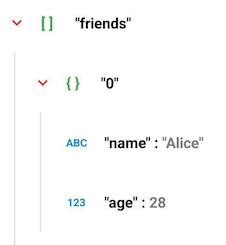

# Android JSON Viewer

[](https://www.buymeacoffee.com/pokeumcho)

[](https://jitpack.io/#pokeum/jsonviewer-xml/)

---

<div align="center">

### JSON Viewer and Beautifier

A lightweight package that will read JSON data, expand and collapse JSON view accordingly.

</div>

---

<div align="center">
  
https://github.com/pokeum/jsonviewer-xml/assets/102505472/e2f260f0-cc28-4607-9ec4-d9744ec9330c

</div>

---

### Easiest way to format Json String

```xml
<co.pokeum.jsonviewer.xml.JsonRecyclerView
  android:layout_width="match_parent"
  android:layout_height="wrap_content"
  app:text="{PUT_YOUR_JSON_STRING}" />
```

## Installation

Add it in your root `build.gradle` at the end of repositories:

```gradle
allprojects {
  repositories {
    // ...
    maven { url 'https://jitpack.io' }
  }
}
```

Add the dependency

```gradle
implementation 'com.github.pokeum:jsonviewer-xml:1.0.0'
```

## Usage

### JsonParser.parse()

Convert `String` into a `JsonElement` object

**Example - Parsing JSON**

```kotlin
val jsonString = "{ \"abc\": \"def\",\"xyz\": 123 }"
            
val jsonParser = JsonParser.Builder().build()
val jsonElement: JsonElement? = try {
  jsonParser.parse(jsonString)
}
// Raise a JSONException if it is not a JSONObject or JSONArray.
catch (e: JSONException) { null }
```

### Use JsonRecyclerView to display JSON

Add `JsonRecyclerView` in XML layout file:

```xml
<co.pokeum.jsonviewer.xml.JsonRecyclerView
  android:id="@+id/jsonViewer"
  android:layout_width="match_parent"
  android:layout_height="wrap_content"
  app:text="{PUT_YOUR_JSON_STRING}" />
```

Change `JsonRecyclerView` text from the code:

```kotlin
findViewById<JsonRecyclerView>(R.id.jsonViewer).setText("{PUT_YOUR_JSON_STRING}")
```

### Use RecyclerView to display JSON

Add `RecyclerView` in XML layout file:

```xml
<androidx.recyclerview.widget.RecyclerView
  android:id="@+id/jsonViewer"
  android:layout_width="match_parent"
  android:layout_height="wrap_content"
  android:orientation="vertical"
  app:layoutManager="androidx.recyclerview.widget.LinearLayoutManager"
  tools:ignore="SpeakableTextPresentCheck"
  tools:listitem="@layout/item_json_object" />
```
  
Set Adapter in `RecyclerView`:

```kotlin
val recyclerView = findViewById<RecyclerView>(R.id.jsonViewer)
recyclerView.adapter = JsonViewerAdapter(/* JsonElement */)
```

## Advance

### JsonParser - Sort JSON

**Example - Alphabetically**

```kotlin
JsonParser.Builder()
  .setComparator(compareBy { it.key })
  .build()
```

### JsonElement - Save and Restore

Save and Restore Data on Configuration Changed in Android using Bundle
    
```kotlin
class YourActivity : AppCompatActivity() {

  private var jsonElement: JsonElement? = null

  override fun onCreate(savedInstanceState: Bundle?) {
    // ...
  
    if (savedInstanceState != null) {
      jsonElement = savedInstanceState.getParcelable("JSON_ELEMENT_KEY")  /* Restore */
    }
  }

  override fun onSaveInstanceState(outState: Bundle) {
    super.onSaveInstanceState(outState)
    outState.putParcelable("JSON_ELEMENT_KEY", jsonElement)  /* Save */
  }
}
```

### Expand All & Collapse All

#### Use JsonRecyclerView

```kotlin
findViewById<JsonRecyclerView>(R.id.jsonViewer).expandAll()
findViewById<JsonRecyclerView>(R.id.jsonViewer).collapseAll()
```

#### Use RecyclerView

```kotlin
val recyclerView = findViewById<RecyclerView>(R.id.jsonViewer)
recyclerView.adapter = JsonViewerAdapter(/* JsonElement */)

val jsonViewerAdapter = recyclerView.adapter as JsonViewerAdapter
jsonViewerAdapter.expandAll()
jsonViewerAdapter.collapseAll()
```

## Custom Styles

### Color

|  |  |
| -- | -- |
| Key | `"friends"`, `"0"`, `"name"`, `"age"` |
| Value | `"Alice"`, `28` |
| Splitter | `:` |
| Type | `ABC`, `123` |
| Arrow | `∨` |
| Bracket | `[ ]`, `{ }` |
| Divider | `│` |

#### Use JsonRecyclerView

  ```xml
  <co.pokeum.jsonviewer.xml.JsonRecyclerView
    ...
    app:keyColor="@color/key_color"
    app:valueColor="@color/value_color"
    app:splitterColor="@color/splitter_color"
    app:typeColor="@color/type_color"
    app:arrowColor="@color/arrow_color"
    app:bracketColor="@color/bracket_color"
    app:dividerColor="@color/divider_color" />
  ```

#### Use RecyclerView

  ```kotlin
  recyclerView.adapter = JsonViewerAdapter(/* JsonElement */).apply {
    setKeyColor(JsonViewerColor(/* color[, dark mode color] */))
    setValueColor(JsonViewerColor(/* ... */))
    setSplitterColor(JsonViewerColor(/* ... */))
    setTypeColor(JsonViewerColor(/* ... */))
    setArrowColor(JsonViewerColor(/* ... */))
    setBracketColor(JsonViewerColor(/* ... */))
    setDividerColor(JsonViewerColor(/* ... */))
  }
  ```
